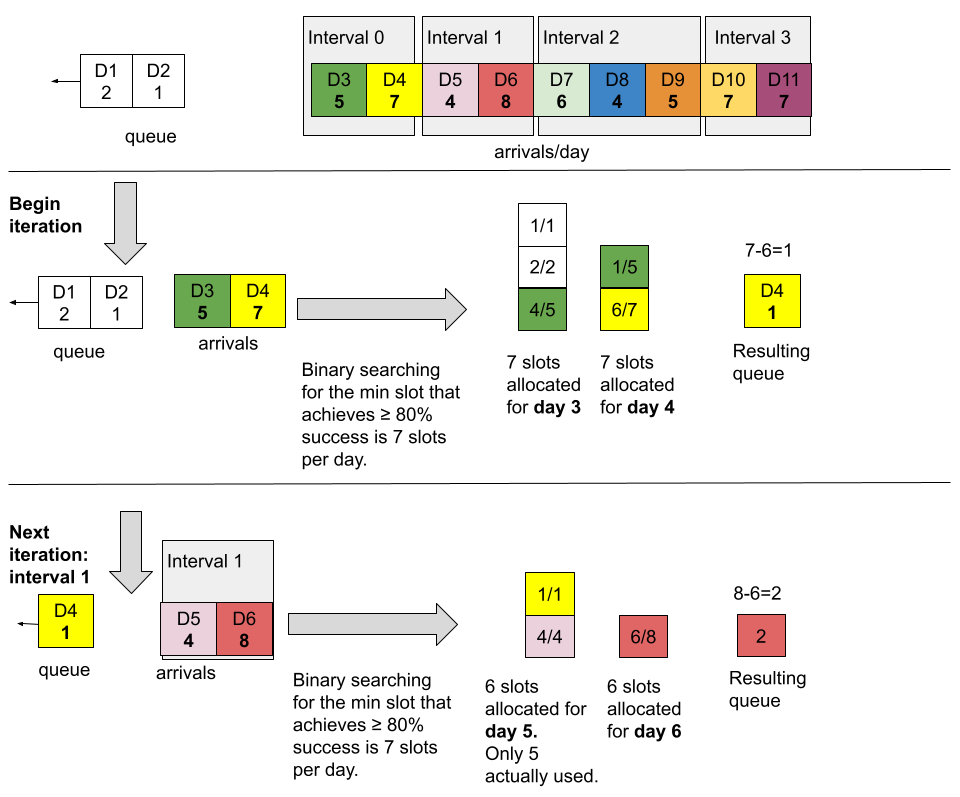

# Minimum Interval Schedule

## Background

Suppose that there is a list of integers, a1,..., a365 partitioned as follows: a1,..., a31, denotes each arrival for January, a32,...,a60 for February, ..., and a334,...a365 for December. There may be cases when a user wants a processing schedule for these arrivals, but wants a more averaged schedule due to whatever restrictions, policies, or practices the user has. Therefore they may want to know the average for January, Febraury, ..., December.

We will talk about the general scheduling problem case agnostic to triaging.

## Requirements

The goal is to return the expected minimum number of slots to process new arrivals satisfying that at least some X% are processed within a time period Y given:
- a set of stochastic arrivals
- the confidence-level

Other requirements:
- The simulation should report the schedule such that all arrivals are accounted for. This means that if a user wants to know arivals from [T1, T2], we will need to simulate [T1, T2 + n], n is a real.
- The simulation should receive some arrivals before the start of the first interval as to not start the relevant prediction period with an empty queue
- Each interval of time does not have to be the same length. Specifically, let ai and aj  both denote a list of integer arrivals for an interval of time such that i≠j, then len(ai) does not have to equal len(aj) </img>
- Each interval must not overlap, but also not have time gaps

## Example input and output
**Input:** X% of arrivals must be seen within Y time period, for intervals January, February, ..., December.
Assume that daily arrivals are known.

**Output:** January - 3/day +/- 0.1, February - 5/day +/- 0.1, ...,  December - 4/day +/- 0.1

## High level algorithm approach: General Example

Suppose that there are a series of arrivals

`arrivals=[5, 7, 4, 8, 6, 4, 5, 7, 7]` which has length 8 and so we have that 5 arrivals occur on day one, 7 on day two, etc.

and at least 80% of arrivals must be seen within a time window period of 1 day. We denote the relative time starting at `0`, and last arrival occurring at time `8`.

Suppose that a user, for planning reasons, wants to know the average processing resources required for the the arrivals grouped in the intervals `[4, 8]` and `[6, 4, 5]`; the user is interested in `n` sublists: `arrivals[2:4]`,  `arrivals[4:7]`, thus leaving `arrivals[0:2]`, and `arrivals[7:]` excluded from the schedules returned to the user.  Instead `arrivals[0:2]`, and `arrivals[7:]` are treated as interval 0, and interval `n+1`

*Note:* the items excluded and included in each intervals is arbitrary and can be redistributed in any fashion. The simulation will still work. The padded arrivals are a recommendations. The time window unit must be less than or equal to any interal size.

The solution will return the minimum number of slots needed on average to process `arrivals[2:4]`, and also the minimum number of slots needed on average to process`arrivals[4:7]`, each considering the predecessing queue. The user is only interested from arrivals from days `2-6` inclusively, but there may be arrivals that cascade to days 7 and ondwards. Therefore if there are carryovers, return the number of slots needed to process arrivals from day `7` to day `7 + time window = 7 + 1 = 8` exclusively.

</img>
<!---
https://docs.google.com/drawings/d/1t2l3r0vrULan6k_jd48q1SW3hKZIcSlz6K-P68zAp6Y/edit?usp=sharing)
-->

For interval `[4,7)`, allocating 6 per unit time (~86.67%) with an empty queue. No need to simulate any more because we only need to return within the user's interest which is times `2-6`

## Edge Cases
Below is discussing the edge cases. The implementation of them is not discussed in case the code changes as this would cause too many updates to the docs. If not addressed, the section will have a _TODO_ note.

### Conditions Leading to an Infeasible Schedule
As a minimization problem with the main boundary being a floor, there aren't a lot of conditions. Howevever see the following:
- [overdue arrivals](#overdue-arrivals)

### Double counting failures
If the queue contains already-failed arrivals from a previous interval, they should not be counted twice.

### Start Queue
#### User input
The user should also be able to input a start queue i.e. a current waitlist to the system and therefore does not need to be simulated.

#### Time between the end of the start queue and the simulation
There should not be a gap between the last queue's arrival time and the start of the simulation time.

### Overlapping intervals
All intervals should be disjoint and the seqence of ascending intervals should be continuous, i.e. \[0, n), \[n, n+m) is valid but \[0, n), \[n+Ɛ, n+m), Ɛ > 0 is not.

### Carryover Arrivals Outside Of End Simulation Time
If a user wants to simulate from time T1 to time T2, arrivals that occur near and on T2 may be processed after T2. The current requirement is to also return the schedule for those arrivals and so additional simulation must be done for time >= T2, denoted `T_post`.

Therefore appended to the arrivals [T1, T2] should be an additional sequence arrivals of length=(2*time window). We make the assumption that if X% must be seen within the time window, then 100% should be seen within the 2nd.

### Overdue Arrivals:
The simulation works on the fact that if there are non-overdue arrivals that must be processed within their time window, every previous arrival must be processed first. This forces overdue arrivals to be processed regardless of how overdue they are. Therefore 2 edge cases arise:

1. There exists no subsequent arrivals for some period of time, and therefore the schedule needs another criteria other than seeing X% of nonoverdue arrivals within Y time window because 0 * X% = 0 slots allocated.
2. All subsequent arrivals are overdue. This follows the same logic as above.

Therefore an another policy is needed: See 100% of overdue arrivals in Y' time. If there is slot allocation that meets the above criterias, then we return that no schedule can be created.

### The arrivals can be for any unit time
In the example above, days were used. In reality it shoud be agnostic to any time.

