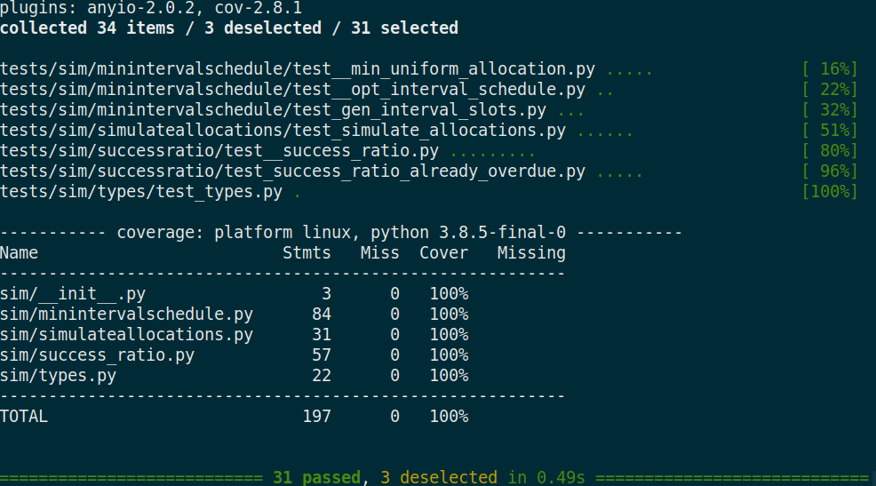

# Simulation Module

A module that given a series of arrivals, generates a schedule or analyzes a schedule via simulation.

See [design details](../docs/sim/minintervalschedule.md) for more info.

## Install

```shell
pip3 install -e .
```

## Tests

To run **all** tests, navigate to the `Triage-Backend/sim` directory and run
```shell
pytest --cov=./resources --cov-report term-missing
```

To run just **unit** tests run
```shell
pytest --cov=./resources --cov-report term-missing -m "not (stress)"
```

To run **stress** tests run

```shell
pytest --cov=./resources --cov-report term-missing -m "(stress)"
```

To run just sim tests from project root:
```shell
pytest sim --cov=./sim/resources --cov-report term-missing -m "not (stress)"
```

#### Example

`pytest --cov=./resources --cov-report term-missing -m "not (stress)"`
</img>

The "Cover" column shows the code coverage of each file

The green column is the current snapshot progress of the test file. If the tests execute really quickly the number will likely not reach 100%.

The last row called TOTAL displays the overall repo coverage. In this case it is 100% of the repository.

It shows that all 31 tests have passed.

The deselected tests depend on which tests are excluded. E.g. when in this example we excluded the tests marked as `stress` which caused 3 tests not to run.

## Interface

### sim.gen_min_interval_slots()

See [design details](../docs/sim/minintervalschedule.md) for more info.

See implementation and interface specifics in the [source code](./resources/minintervalschedule.py)

### sim.simulate_allocations()

Simulate the proposed schedule and return the processing results of each arrival.

See implementation and interface specifics in the [source code](./sim/resources/simulateallocations.py)
